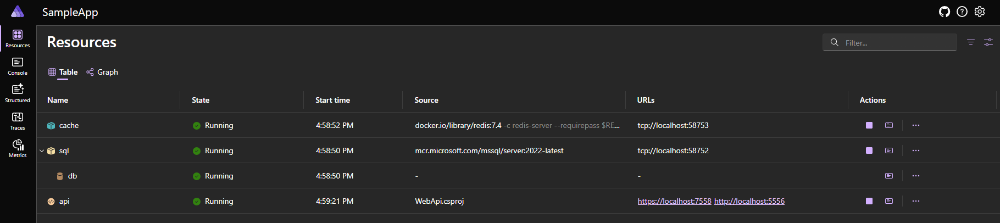

# Hello Aspire: Introduction to .NET Aspire

.NET Aspire is the latest framework from Microsoft in the .NET ecosystem, adding to ASP.NET, Blazor, Entity Framework, MAUI, etc. Released in 2023, it was designed specifically for cloud-native and distributed applications and acts as an orchestrator for the entire application stack. It is opinionated, meaning it provides a set of conventions and best practices for how to build applications. If you adopt these opinions, Aspire makes the developer experience much smoother and more productive. Some of these benefits include:

- **Application modeling**: Aspire allows you to model your application in C# code instead of using YAML or other configuration languages.
- **Opinionated service defaults**: It provides a set of default configurations and settings for common cloud-native concerns, which can be extended or overridden as needed.
- **Client integrations**: Aspire includes client libraries and SDKs for common cloud-native services, making it easier to integrate your application with dependencies locally and in the cloud.
- **Local development**: It provides a seamless local development experience, allowing you to start and stop your entire application with a single command.
- **Automated testing**: Aspire can be used with existing test frameworks to spin up and tear down your entire application stack for integration or functional tests.

In this post, I will provide some background on Aspire and overview of its key features. I will also provide some code snippets to help get started. These snippets will be in C# or CLI commands, but are not exhaustive. You can find examples of how to get started with Visual Studio, Visual Studio Code, or the command line on the [Microsoft Learn](https://learn.microsoft.com/en-us/dotnet/aspire/) documentation.

## Brief history so far

At the initial launch of Aspire, the communication was obtuse about the purpose of this new framework. It was described as "an opinionated, cloud ready stack for building observable, production ready, distributed applications." This was a bit vague and left many developers including myself wondering what exactly it offered. However, as others including myself started to play with it, we quickly realized it was an exciting new way to manage the complexity of building modern applications.

Since then, the Aspire team has been quickly evolving the framework and adding new features based on community reception. This has led to features like the `Aspire.Hosting.Testing` package for automated testing and the upcoming Aspire CLI.

## Support and updates

Aspire is unique in that most of the features are not used in production, but instead are used during the local development process and help prepare for production. Additionally, the Aspire team is releasing new features and updates at a rapid pace as a new framework. Because of this, Aspire and the team at Microsoft are shipping updates to Aspire multiple times a year and _only the latest version of Aspire is currently supported_. This is a culture shock for many .NET developers familiar with the LTS/STS yearly releases of .NET, but as we explore what Aspire is and how it works, you will see this is a good thing and introduces minimal risk to your production applications.

## Key features of Aspire

### Application modeling

Aspire provides a set of abstractions and patterns for modeling your application in C# code. This significantly differs from alternatives like Docker Compose where YAML is used to define your model. The C# code-first approach feels more natural for .NET developers and allows for a similar experience to how you write other application configuration features for startup or dependency injection, but now modeling your external and distributed dependencies.

Using a new `AppHost` project in your solution, you can model the makeup of your distributed application. Below is a sample `Program.cs` that includes a ASP.NET Web API, SQL Server database, and Redis cache.

```csharp
var builder = DistributedApplication.CreateBuilder(args);

var sql = builder.AddSqlServer("sql")
                 .AddDatabase("db");

var cache = builder.AddRedis("cache");

var api = builder.AddProject<Projects.WebApi>("api")
                 .WithReference(sql)
                 .WaitFor(sql)
                 .WithReference(cache)
                 .WaitFor(cache)
                 .WithExternalHttpEndpoints();

await builder.Build().RunAsync();
```

The app host project also includes a `.csproj` file includes a reference to the Aspire SDK and hosting integrations unique to Aspire. A sample `.csproj` file for the above app host project might look like this:

```xml
<Project Sdk="Microsoft.NET.Sdk">

  <Sdk Name="Aspire.AppHost.Sdk" Version="9.2.0" />

  <PropertyGroup>
    <OutputType>Exe</OutputType>
    <TargetFramework>net9.0</TargetFramework>
    <ImplicitUsings>enable</ImplicitUsings>
    <Nullable>enable</Nullable>
    <UserSecretsId>{{SomeGuid}}</UserSecretsId>
  </PropertyGroup>

  <ItemGroup>
    <ProjectReference Include="..\WebApi.csproj" />
  </ItemGroup>

  <ItemGroup>
    <PackageReference Include="Aspire.Hosting.AppHost" Version="9.2.0" />
    <PackageReference Include="Aspire.Hosting.Redis" Version="9.2.0" />
    <PackageReference Include="Aspire.Hosting.SqlServer" Version="9.2.0" />
  </ItemGroup>

</Project>
```

These two key files make up the heart of Aspire's core feature: the application host. With them, we have a new entry point for our local application that can start up our .NET application and two different backing services. With the press of F5 in Visual Studio or running `dotnet run` against our app host project, all three components will start up and be available for use. This includes the ASP.NET Web API, SQL Server database, and Redis cache. The app host project also provides a dashboard for visualizing your application stack and managing the lifecycle of your services.

Our dashboard will look something like this:



This dashboard provides a visual representation of our application stack resources, console logs, and telemetry data for each of the services. It becomes the central UI hub for exploring our local app.

### Opinionated service defaults

Aspire provides a set of default configurations and settings for common cloud-native concerns including instrumentation, monitoring, and service discovery. These defaults are defined once in a new project and then applied to other projects in the solution. You can extend, override, or opt-out of these defaults as needed, but the goal is to provide a set of best practices that you can follow to get started quickly.

### Client integrations

Aspire provides a set of client libraries and SDKs for common cloud-native services, such as SQL Server, Redis, Azure Service Bus, and OpenAI. These libraries are designed to seamlessly integrate your application with dependent services locally and post-deployment. This allows you to focus on writing your application code without worrying about the underlying infrastructure.

### Local development

Aspire provides a local development experience that is similar to how you would run your application in the cloud. This includes support for containerized services and executable workloads traditionally outside the .NET ecosystem. For example, you can run a PostgreSQL database, Java backend, and JavaScript frontend by starting the Aspire app host project with or without any other C# code in your solution. You get a dashboard for visualizing your application stack and a unified way to start and stop the entire distributed system.

### Automated testing

As an orchestrator for your local environment, Aspire can spin up and tear down your entire application stack for automated testing. Using the `Aspire.Hosting.Testing` package and your existing test framework, you can write integration or functional tests in C# that run against your actualized application in the same environment as you develop in. This allows you to test your application in more realistic scenarios and catch issues earlier in the local developer process instead of waiting for a deployment to a staging or production environment.

## Conclusion

Aspire is an exciting new addition to the .NET ecosystem. It is actively evolving and has a lot of potential to simplify the developer experience locally and in the path to production. If you have not already, I encourage you to try adding it to your existing projects or start your next with it. If you are interested in learning more, follow along as I explore the framework in more detail in future posts. I will be diving into specific features such as the application host, extending service defaults, and integrations with common backing services. Or, if you cannot wait, check out the [Aspire on Microsoft Learn](https://learn.microsoft.com/en-us/dotnet/aspire/) for official documentation.
